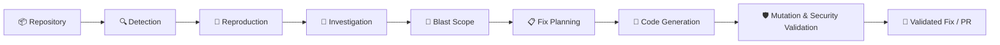
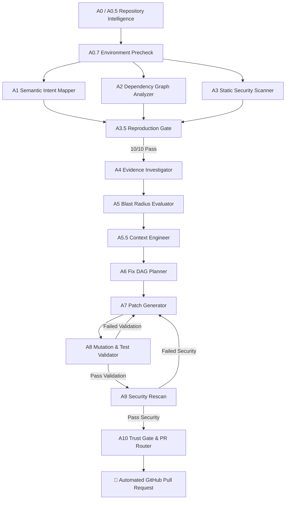

<div align="center">

# 🛠️ PROOFIX
### **Autonomous Multi-Agent Repository Analysis, Bug Investigation & Validated Fix Generation**

```text
┌─────────────────────────────────────────────────────────────────────────────────┐
│ 🔍 Analyze → 🧪 Reproduce → 🧠 Investigate → 🎯 Scope → 🔧 Fix → 🛡️ Validate │
└─────────────────────────────────────────────────────────────────────────────────┘
```

[](#)
[](#)
[](#)
[](#)
[](#)
[](#)
[](#)
[](#)

[ 🚀 Quick Start ](#-quick-start) &nbsp;|&nbsp; [ 🏗️ Architecture ](#-multi-agent-architecture) &nbsp;|&nbsp; [ 🧪 Demo Scenario ](#-demo-scenario) &nbsp;|&nbsp; [ 📊 Benchmark ](#-numbers-that-matter)

</div>

---

## 💡 What is ProoFix?

**ProoFix** is an autonomous multi-agent software engineering platform that analyzes code repositories, reproduces bugs, investigates root causes, measures blast radius, generates candidate fixes, and validates patches through mutation testing before proposing a GitHub Pull Request.

Rather than relying on a single LLM prompt to guess code changes, ProoFix orchestrates **11 specialized agents** in a deterministic pipeline where every fix is backed by empirical runtime evidence.

---

## 🔄 High-Level Pipeline



---

## ⚡ Why ProoFix?

| Feature / Capability | Traditional AI Coding | 🛠️ ProoFix Autonomous Pipeline |
| :--- | :--- | :--- |
| **Approach** | Single LLM prompt guessing | **11-Agent specialized pipeline** |
| **Bug Reproduction** | None (assumes bug exists) | **10/10 stable deterministic reproduction gate** |
| **File Target Selection** | Often modifies wrong files | **AST Semantic Intent Graph & call tree mapping** |
| **Impact Radius** | Unchecked (causes regressions) | **Blast-radius analysis across dependent modules** |
| **Fix Validation** | No post-fix verification | **MutMut mutation testing + regression test suite** |
| **Security Assurance** | Code patched blindly | **Automated post-fix security rescan (Bandit/Ruff)** |
| **Quality Gate** | Direct code edit | **Mutation Certification Index (MCI) trust gating** |

---

## 🤖 Multi-Agent Architecture



---

## 📊 Numbers That Matter

<div align="center">

| Metric | Benchmark Value | Description |
| :---: | :---: | :--- |
| **10/10** | **Reproduction Stability** | Required test reproduction pass rate before declaring bug confirmed |
| **11** | **Specialized Agents** | Independent pipeline agents with distinct domain boundaries |
| **4+** | **Trust & Validation Gates** | Precheck, Reproduction, Mutation, and Security verification levels |
| **100ms** | **AST Graph Indexing** | Incremental AST repository indexing & call-graph caching |
| **100%** | **Evidence Provenance** | No fix generated without attached test & log trace evidence |

</div>

---

## 🎬 Demo Scenario

Suppose a target repository contains an authentication token expiration bypass:

```text
1. 📥 Repository Submission    ➜ User submits target repository path or Git URL.
2. 🔍 Static Analysis          ➜ A3 identifies potential flaw in auth token validation logic.
3. 🧪 Runtime Reproduction     ➜ A3.5 auto-generates pytest case (10/10 stable reproduction).
4. 🧠 Root-Cause Investigation ➜ A4 correlates call-stack, AST citations, and error trace.
5. 🎯 Blast Scope Analysis     ➜ A5 maps dependent API endpoints affected by auth modifications.
6. 📋 Fix DAG Planning        ➜ A6 formulates file change dependencies and modification order.
7. 🔧 Patch Generation         ➜ A7 generates targeted patch diff repairing the token check.
8. 🛡️ Mutation Validation      ➜ A8 runs regression suite + MutMut mutation testing.
9. 🔒 Post-Fix Security Rescan ➜ A9 verifies no new security vulnerabilities were introduced.
10. 🚀 PR Creation             ➜ A10 calculates MCI score & opens automated GitHub Pull Request.
```

---

## ✨ Key Features

### 🔍 Deep Repository Understanding
* **Semantic Intent Graph (A1)**: Maps AST structures, docstrings, and function semantics.
* **Call Graph Analysis (A2)**: Traces inter-module reachability and caller/callee trees.

### 🧪 Deterministic Reproduction Gate (A3.5)
* Executes candidate tests directly against the working tree.
* Enforces **10/10 reproduction stability** to eliminate false positives and LLM hallucinations.

### 🔬 Evidence Investigation (A4)
Classifies evidence rigorously before attempting repairs:
```text
Supporting Evidence ──► Reproduction Logs + Scanner Alerts + AST Citations
Contradicting Evidence ──► Flagged if evidence conflicts with findings
Unavailable Evidence ──► Tools inactive or test suite non-executable
```

### 💥 Blast Radius & Context Engineering (A5 & A5.5)
* Calculates downstream impact across dependent files before touching code.
* Engineers targeted context snippets for optimal LLM fix generation.

### 🧬 Mutation & Security Validation (A8 & A9)
* **Mutation Validation**: Runs `mutmut` and test suites to verify fix efficacy.
* **Security Rescan**: Re-scans updated files with `Bandit` and `Ruff`.
* **Automatic Retry Loop**: Feeds validation errors back to **A7** for iterative repair.

---

## 🛠️ Tech Stack & Architecture

| Category | Technologies |
| :--- | :--- |
| 🖥️ **Frontend** | React 18, TypeScript, Vite, TanStack Router, Tailwind CSS |
| ⚙️ **Backend** | Python 3.11+, FastAPI, Uvicorn, Pydantic v2 |
| 🤖 **Agent Orchestration** | LangGraph, LangChain Core, State Graph Nodes |
| 🧠 **LLM Providers** | Anthropic (`claude-3-5-sonnet`), Mistral (`codestral-latest`), Offline Stub Mode |
| 🗄️ **State & Storage** | Redis (Async state engine, event streaming, WebSockets) |
| 🔍 **Code Analysis & Testing** | Python AST, NetworkX, spaCy, Pytest, Bandit, Ruff, MutMut, PyGithub |

---

## 📋 Agent Pipeline Breakdown

| Agent | Module | Role & Responsibility |
| :--- | :--- | :--- |
| **A0 / A0.5** | `repository_intelligence.py` | Orchestration, cross-run caching, knowledge graph indexing |
| **A0.7** | `a0_7_environment.py` | Precheck environment & test runner readiness |
| **A1** | `a1_semantic_mapper.py` | AST parsing, docstrings, Semantic Intent Graph (SIG) generation |
| **A2** | `a2_dependency_analyzer.py` | Call graph construction & import reachability analysis |
| **A3** | `a3_static_analysis.py` | Static vulnerability & code quality scanning (Bandit/Ruff) |
| **A3.5** | `a3_5_reproduction.py` | Test generation & 10/10 stability reproduction gating |
| **A4** | `a4_evidence_investigator.py` | Evidence correlation & root cause diagnosis |
| **A5** | `a5_blast_graph.py` | Downstream impact & blast radius calculation |
| **A5.5** | `a5_5_context_engineering.py` | Target snippet context engineering for LLM prompts |
| **A6** | `a6_fix_dag_planner.py` | Fix DAG planning & file modification ordering |
| **A7** | `a7_code_generation.py` | Code patch generation and safe application |
| **A8** | `a8_mutation_validator.py` | Regression execution & mutation validation (`mutmut`) |
| **A9** | `a9_security_rescan.py` | Post-fix security rescan & vulnerability verification |
| **A10** | `a10_routing.py` / `a10_mci_scorer.py` | MCI scoring, trust gating, and automated GitHub PR routing |

---

## 🚀 Quick Start

### 1. Clone & Setup Backend

```bash
# Clone repository
git clone https://github.com/your-org/Proofix.git
cd Proofix

# Create and activate virtual environment
python -m venv .venv

# macOS / Linux:
source .venv/bin/activate
# Windows:
.venv\Scripts\activate

# Install backend dependencies
pip install -e ".[dev]"

# Download spaCy NLP model
python -m spacy download en_core_web_sm

# Configure environment file
cp .env.example .env
```

---

### 2. Environment Configuration (`.env`)

```env
# Execution Mode
STUB_MODE=false               # Set to true for offline testing without LLM keys
LLM_PROVIDER=anthropic        # Options: anthropic | mistral

# API Keys
ANTHROPIC_API_KEY=your_anthropic_api_key
ANTHROPIC_MODEL=claude-3-5-sonnet-20241022

# Infrastructure
REDIS_URL=redis://localhost:6379/0
GITHUB_TOKEN=your_github_pat_token

# Speech-to-Text (Voice input)
SARVAM_API_KEY=your_sarvam_api_key
```

---

### 3. Start Redis & Servers

**Terminal 1 (Backend)**:
```bash
# Start Redis (macOS / Docker)
brew services start redis  # OR: docker run -d -p 6379:6379 redis:alpine

# Start FastAPI API
source .venv/bin/activate
uvicorn backend.main:app --reload --host 127.0.0.1 --port 8000
```

**Terminal 2 (Frontend)**:
```bash
cd frontend
npm install
npm run dev
```
Open `http://localhost:5173` to launch the ProoFix Workspace.

---

### 4. Execute a Pipeline Run

```bash
curl -X POST http://127.0.0.1:8000/runs \
  -H "Content-Type: application/json" \
  -d '{"repo_path": "vulnapi"}'
```

---

## 📁 Project Structure

```text
Proofix/
├── backend/
│   ├── agents/               # Pipeline agents (A0.7 -> A10)
│   ├── api/routes/           # REST API & WebSocket handlers
│   ├── models/               # Data schemas & verification models
│   ├── orchestrator/         # LangGraph workflow, nodes, edges & trust gates
│   ├── security/             # Vulnerability scanning modules
│   ├── services/             # Git operations & repository graph indexing
│   ├── state/                # Redis state store
│   ├── config.py             # System settings
│   └── main.py               # FastAPI entrypoint
├── frontend/
│   ├── src/
│   │   ├── components/       # Workspace UI components
│   │   ├── hooks/            # Custom hooks & WebSockets
│   │   ├── routes/           # Router views
│   │   └── styles.css        # Stylesheet
│   ├── package.json
│   └── vite.config.ts
├── vulnapi/                  # Seeded benchmark target codebase
├── docs/                     # System specifications & design docs
├── tests/                    # Unit & integration tests
├── pyproject.toml            # Build & package configuration
└── README.md
```

---

## 🔐 Security & Governance

ProoFix ensures zero unsandboxed execution risks:
* **Server-Side Credentials**: All LLM keys, Sarvam voice keys, and GitHub tokens remain server-side.
* **Non-Executing Environment Precheck**: `A0.7` probes dependency availability without executing un-sandboxed build scripts.
* **Mandatory Post-Fix Security Rescan**: Patches are rescanned with `A9` before PR creation.

---

## 🧪 Testing

Run backend tests:
```bash
pytest tests/ -q
```

Run frontend production build verification:
```bash
cd frontend && npm run build
```

---

## 📄 License

This project is licensed under the [MIT License](LICENSE).
